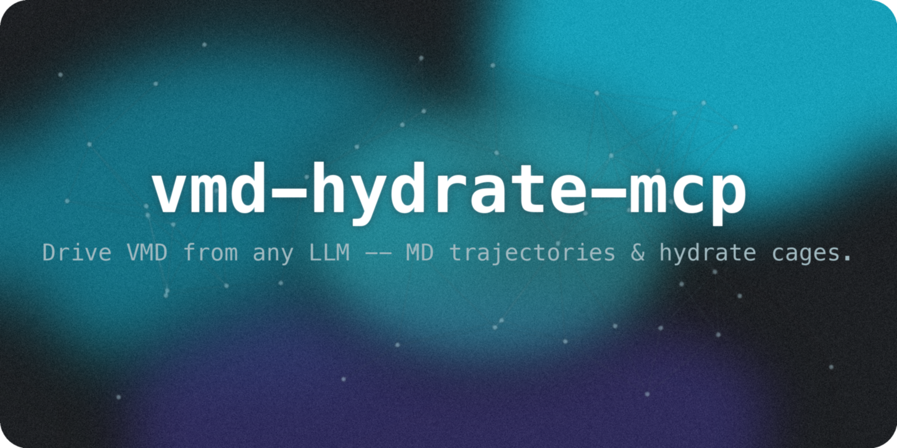
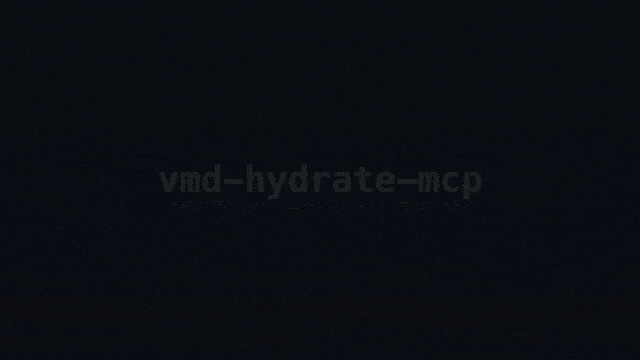
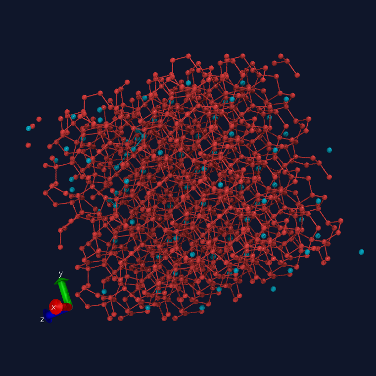
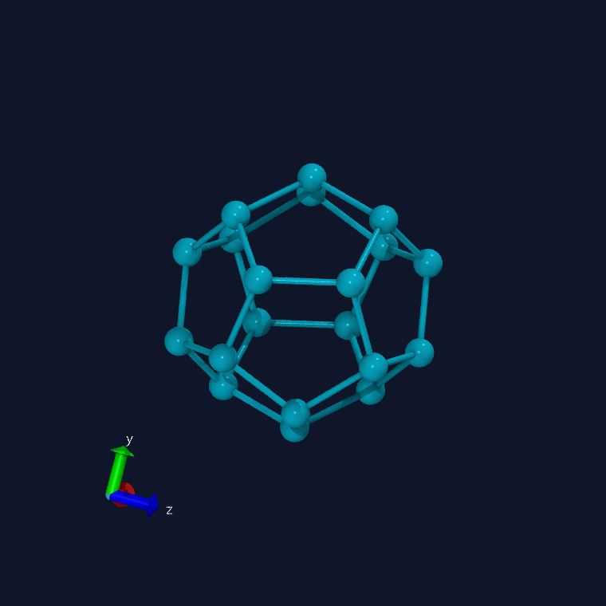

<!-- mcp-name: io.github.wjgoarxiv/vmd-hydrate-mcp -->
<p align="center"></p>

<h1 align="center">vmd-hydrate-mcp</h1>
<p align="center">
  <em>어떤 LLM으로든 VMD를 조종하세요 — GROMACS/LAMMPS 궤적을 렌더링하고 클라스레이트 하이드레이트 케이지를 Model Context Protocol로 분석합니다.</em>
</p>
<p align="center">
  <a href="#빠른-시작">빠른 시작</a> · <a href="#기능">기능</a> · <a href="#mcp-도구">MCP 도구</a> · <a href="#사용법">사용법</a> · <a href="./README.md">English</a>
</p>
<p align="center">
  
  
  
  
  
</p>

---

[English](./README.md) | **한국어**

---

> [!NOTE]
> Claude(또는 모든 MCP 클라이언트)가 **VMD**를 직접 제어하게 해 주는 MCP 서버입니다 — GROMACS/LAMMPS 궤적을 불러오고, **클라스레이트 하이드레이트 케이지를 식별**(sI/sII/sH)하며, 헤드리스 렌더링을 스크립팅하고, 오더 파라미터(F3/F4)와 수소결합 네트워크를 계산합니다. 분자동역학 분석을 대화로 바꿉니다. 기존 VMD MCP와 달리 **상태를 유지하는** VMD 세션을 쓰고, **기본적으로 안전**하며, 다른 어떤 MCP도 하지 못하는 **하이드레이트 케이지 과학**을 담당합니다.

## 데모

<p align="center"></p>

<p align="center"><em>모든 프레임은 MCP 서버를 통해 구동된 <strong>실제 헤드리스 VMD(Tachyon) 렌더</strong>입니다. sII 케이지(128 × 5¹² + 60 × 5¹²6⁴)는 <strong>이 리포가 직접 식별</strong>한 것이며, 목업이 아닙니다. · <a href="./docs/media/demo.mp4">▶ 고화질 MP4</a></em></p>

## 기능

- **클라스레이트 케이지 식별** -- 수소결합 네트워크로부터 하이드레이트 케이지(5¹², 5¹²6², 5¹²6⁴, …)를 찾아 분류하고 결정 구조(sI/sII/sH)를 판별합니다. sII 벤치마크에서 검증(작은 케이지 128개, 정확).
- **실사급·프롬프트 스타일링 케이지 렌더링** -- 앰비언트 오클루전 + 그림자로 렌더링하며, 기본 **정사영(orthographic)**, 케이지 유형마다 하나의 통일된 색(엄선된 팔레트: 5¹²=cyan, 5¹²6⁴=red, …). *"sII 큰 케이지만 magenta로, width 강조해서"* 라고 말하면 MCP가 해당 케이지만 필터링·재색상·두께 강조합니다.
- **상태 유지 VMD 세션** -- 영구 VMD 프로세스(Tcl 소켓 서버)가 분자·선택·카메라를 도구 호출 사이에도 유지합니다. 매 명령마다 다시 로드하지 않습니다.
- **하이드레이트 오더 파라미터** -- F3(사면체성)와 F4(⟨cos 3φ⟩)를 순수 NumPy로 계산하며, 레퍼런스와 소수점 6자리까지 검증되었습니다(sII 벤치마크에서 F4 = 0.926698).
- **수소결합 네트워크** -- 물–물 수소결합 그래프와 배위수 통계. 케이지 식별의 기반입니다.
- **헤드리스 렌더링** -- 디스플레이나 GPU 없이 CPU Tachyon 레이트레이싱 PNG를 생성해 이미지로 인라인 반환합니다. 노트북·서버·HPC 어디서든 동작합니다.
- **GROMACS + LAMMPS** -- 하나의 서버가 `.gro/.xtc/.trr`, LAMMPS `.data/dump`, PDB, DCD, mmCIF를 처리합니다.
- **기본 보안** -- 파일시스템 화이트리스트 + Tcl 명령 화이트리스트(우회 가능한 블랙리스트가 아님) + 루프백·토큰 게이트 제어 소켓. 위험한 `run_tcl`을 노출하지 않습니다.
- **MCP 네이티브** -- 깔끔한 영어 도구 이름과 타입 지정 출력. Claude Desktop, Claude Code, 모든 MCP 클라이언트에서 동작합니다.

## 빠른 시작

> [!IMPORTANT]
> **로컬 VMD 설치 필요** (2.0b1 또는 1.9.4+) — 이 서버는 *당신의* VMD를 구동합니다. 어떤 레지스트리/패키지도 VMD를 제공하지 않습니다. macOS에서는 VMD가 `.app` 안에 있으므로 `vmd`가 `PATH`에 없으면 `VMD_BIN`을 지정하세요. (순수 하이드레이트/측정 도구는 VMD 없이도 동작합니다.)

### 설치

`uvx`로 무설치 실행 (권장):

```bash
uvx vmd-hydrate-mcp                                  # 서버 실행
uvx --from 'vmd-hydrate-mcp[mda]' vmd-hydrate-mcp    # + 측정/선택용 MDAnalysis
```

또는 소스에서:

```bash
git clone https://github.com/wjgoarxiv/vmd-hydrate-mcp.git
cd vmd-hydrate-mcp && uv pip install -e ".[mda]"
```

### MCP 클라이언트에 등록

**Claude Code** — 한 줄:

```bash
claude mcp add vmd-hydrate -- uvx vmd-hydrate-mcp
```

**Claude Desktop / 기타 클라이언트** — `mcpServers` 설정에 추가(또는 프로젝트 `.mcp.json` 커밋):

```json
{
  "mcpServers": {
    "vmd-hydrate": {
      "command": "uvx",
      "args": ["vmd-hydrate-mcp"],
      "env": { "VMD_HYDRATE_MCP_ALLOW_DIR": "/path/to/your/data" }
    }
  }
}
```

> [!IMPORTANT]
> `VMD_HYDRATE_MCP_ALLOW_DIR`(OS 경로 구분자로 구분)를 서버가 읽어도 되는 디렉터리로 설정하세요. 모든 파일 인자는 이 화이트리스트에 대해 realpath로 검사되며, 벗어난 경로는 거부됩니다.

## MCP 도구

| 도구 | 목적 | 백엔드 |
|---|---|---|
| `vmd_status` | VMD 버전 + 세션에 로드된 분자 | VMD |
| `load_structure` | 구조/궤적 로드(`molid` 반환) | VMD |
| `list_molecules` | 로드된 분자 목록 | VMD |
| `set_representation` | 스타일/색/재질/선택 설정 | VMD |
| `render` | 현재 뷰의 헤드리스 PNG | VMD + Tachyon |
| `resolve_selection` | 선택의 원자 수(빈 `.gro` 0-원자 함정 방지) | MDAnalysis |
| `measure_geometry` | 원자 인덱스로 거리/각도/이면각 | MDAnalysis |
| `radius_of_gyration` | 선택의 회전반경 | MDAnalysis |
| `hydrate_order_params` | **F3 + F4 물 오더 파라미터** | NumPy |
| `hbond_network` | **물 수소결합 네트워크 + 배위수** | NumPy |
| `identify_cages` | **케이지 개수(5¹²/5¹²6⁴/…) + sI/sII/sH 구조** | NumPy |
| `render_cages` | **실사급 케이지 렌더(AO+그림자, 정사영); 프롬프트로 케이지 필터/색상/강조** | VMD + NumPy |

## 사용법

**1. 궤적 프레임의 하이드레이트 오더 분석**
```
hydrate.gro의 F3/F4 오더 파라미터를 계산해줘
```
`f4_overall`, `f3_overall`, 물 개수, 그리고 자연어 해석(결정질/하이드레이트/액체/얼음)을 반환합니다.

**2. 구조 렌더링**
```
hydrate.gro를 불러와서 물 산소를 VDW 구로 표시하고 렌더링해줘
```
CPU Tachyon으로 헤드리스 렌더링한 PNG를 인라인으로 생성합니다.

**3. 수소결합 네트워크 확인**
```
hydrate.gro의 프레임 0에서 물 수소결합 네트워크를 만들어줘
```
결합 수와 평균 배위수를 반환합니다(잘 형성된 클라스레이트는 ≈4).

**4. 프롬프트로 케이지 스타일링**
```
hydrate.gro 불러와서 sII 큰 케이지만 magenta로, width 강조해서 보여줘
```
5¹²6⁴ 케이지만 magenta에 두꺼운 엣지로, 정사영·실사급으로 렌더링합니다 — MCP가 `render_cages(cage_types=["51264"], highlight_color="magenta", emphasis=True)`로 매핑합니다. 필터 없이 요청하면 모든 케이지 유형이 팔레트 색상(5¹²=cyan, 5¹²6⁴=red, …)으로 그려집니다.

## 정말 VMD를 제어하나요?

네 — 명령 한 줄로 확인할 수 있습니다. [`examples/verify.py`](./examples/verify.py)는 MCP 서버가 노출하는 것과 동일한 코드를 내장 sII CO₂ 하이드레이트 예제에 실행합니다: 실제 VMD 바이너리에 ping을 보내고, 케이지를 식별하고, 헤드리스로 렌더링합니다.

```bash
python examples/verify.py
```

예상 출력:

```text
[1] VMD found : /Applications/VMD2b1.app/.../vmd_MACOSXARM64
    ping      : pong 2.0b1 MACOSXARM64
[2] Identifying cages in a real sII CO2 hydrate (1088 waters)...
    cage counts : {'51264': 60, '512': 128}
    structure   : sII  (confidence 0.93)
    F4 order    : 0.965  (highly ordered (crystalline hydrate / ice-like))
[3] Rendering cages headlessly (blue = 5^12, red = 5^12 6^4)...
    saved       : examples/output/cages.png (362495 bytes)
OK — vmd-hydrate-mcp drove VMD and identified the cages above.
```

아래 이미지는 이 파이프라인이 만든 **실제 VMD 렌더**입니다(그림이 아님):

<table>
<tr>
<td align="center" width="50%"><br/><em>sII 결정 — 케이지 유형별 색상(cyan 5¹², red 5¹²6⁴), 실사급 Tachyon</em></td>
<td align="center" width="50%"><br/><em>단일 5¹² 십이면체, PBC 언랩 (앰비언트 오클루전 + 그림자)</em></td>
</tr>
</table>

상단 데모 영상은 이런 프레임들로 구성됩니다 — [`video/build_frames.py`](./video/build_frames.py)(VMD 구동)와 [`video/remotion/`](./video/remotion/)(Remotion 합성) 참고.

## 작동 원리

```
  [.gro / .xtc / LAMMPS dump]
            |
            v
     MCP 클라이언트 (Claude)  --stdio-->  vmd-hydrate-mcp (FastMCP)
                                          |            |
                          수치  <---------+            +------>  시각화
                     MDAnalysis + NumPy                     영구 VMD 세션
                   (F3/F4, 수소결합, Rg)                  (Tcl 소켓, 127.0.0.1)
                          |                                         |
                          v                                         v
                   구조화된 JSON                          Tachyon --> PNG 이미지
```

수치 과학은 Python에서 실행됩니다(디스플레이 불필요, CI에서 단위 테스트 가능). 시각화와 렌더링은 수명이 긴 토큰 게이트 VMD 프로세스에서 실행됩니다. 두 경로는 단위를 절대 섞지 않습니다: 하이드레이트 수학은 나노미터, VMD/MDAnalysis 측정은 옹스트롬입니다.

## 요구 사항

| 의존성 | 필수 | 용도 |
|---|---|---|
| VMD 2.0b1 또는 1.9.4+ | 시각화/렌더링용 | 시각화 엔진 |
| Python 3.10+ | 예 | 서버 |
| `mcp` | 예 | Model Context Protocol SDK |
| MDAnalysis (`[mda]`) | 측정/선택용 | 토폴로지 인식 로딩 |
| `sips` / ImageMagick / Pillow | 렌더링용 | TGA→PNG 변환 |

> [!WARNING]
> macOS에서 VMD는 `.app`으로 배포되며 CLI 바이너리는 번들 내부에 있습니다. `vmd`가 `PATH`에 없으면 `VMD_BIN`을 바이너리 경로로 지정하세요(예: `/Applications/VMD*.app/Contents/vmd*/vmd_MACOSXARM64`). 순수 하이드레이트/측정 도구는 VMD 없이도 동작합니다.

## 기여하기

1. 포크 후 브랜치 생성 (`git checkout -b feature/x`).
2. `uv pip install -e ".[dev,mda]"` 후 `pytest`를 통과 상태로 유지(과학 테스트는 VMD 불필요).
3. 커밋, 푸시, PR 생성. 버그를 찾으면 이슈를 열어주세요.

## 라이선스

MIT — [LICENSE](./LICENSE) 참고.
